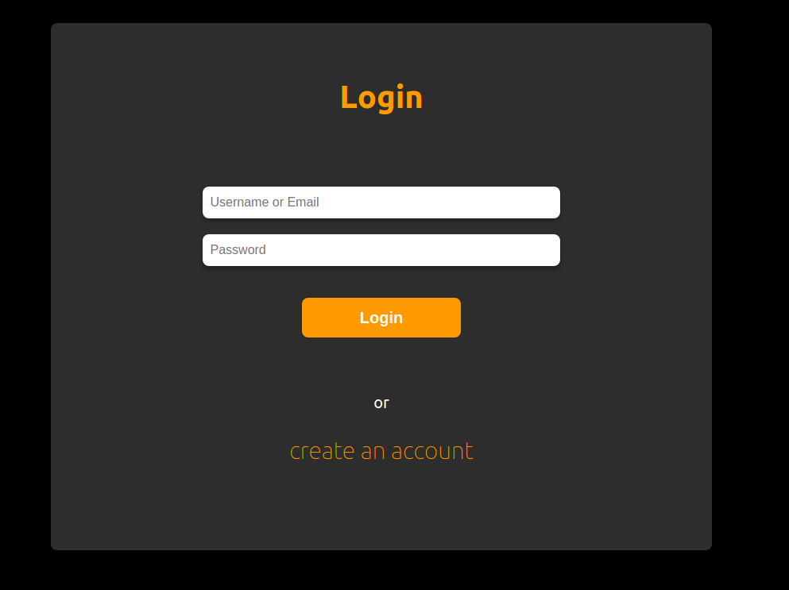
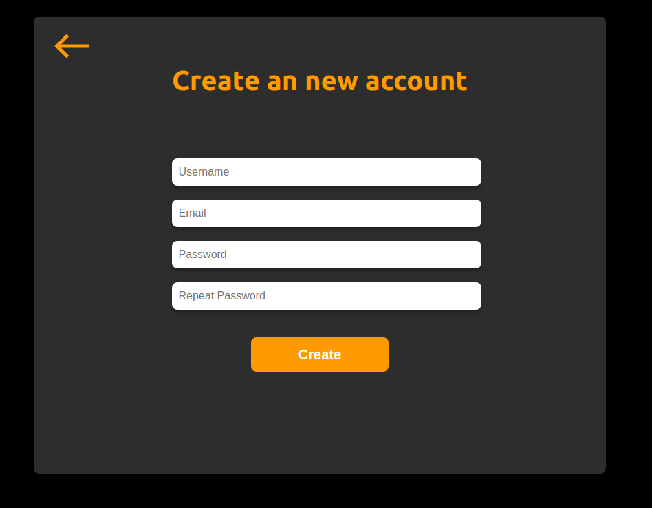
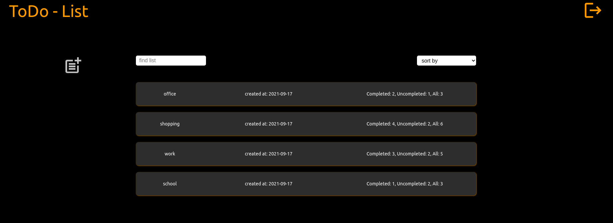
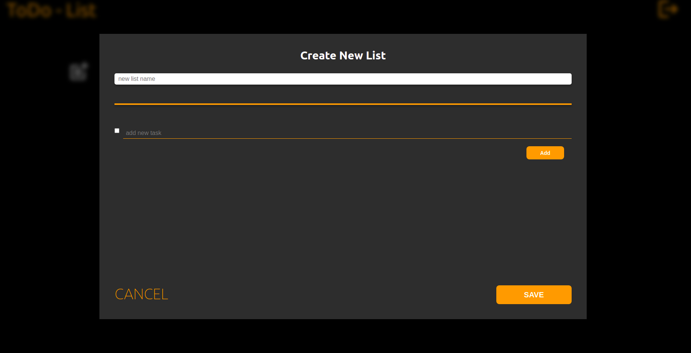
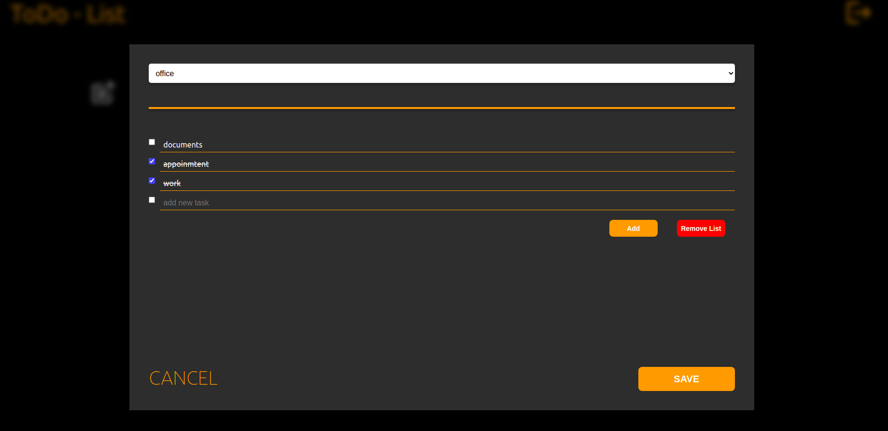

# Getting Started with Create React App

This project was bootstrapped with [Create React App](https://github.com/facebook/create-react-app).

## Available Scripts

In the project directory, you can run:

### `npm start`

Runs the app in the development mode.\
Open [http://localhost:3000](http://localhost:3000) to view it in the browser.

### `npm test`

Launches the test runner in the interactive watch mode.\
See the section about [running tests](https://facebook.github.io/create-react-app/docs/running-tests) for more information.

### `npm run build`

Builds the app for production to the `build` folder.\

# App's guidelines:

### `LogIn form and a signup form view:`

 

### `List view:`

- After click list element you get modal of list details like its tasks and possobility of manipulation of this list like checking task as done and remove lists

- After select "plus icon" you get new list modal where you can create new list and its tasks.

- There is possibility of searching for todo list by list name and sort by create date or name

### `New list modal:`

- You can create new list and add new tasks to this list
- There is no possibility to mark task as done
- At the end you have to click the "SAVE" to keep changes and view them in the list immediately after your save

### `List modal:`

- At the top of the modal there is an input of all lists and you can jump through them
- It is possible to remove more than one list at once and then save this changes
- If you manipulate tasks of the chosen list you have to save changes before jump to another list

